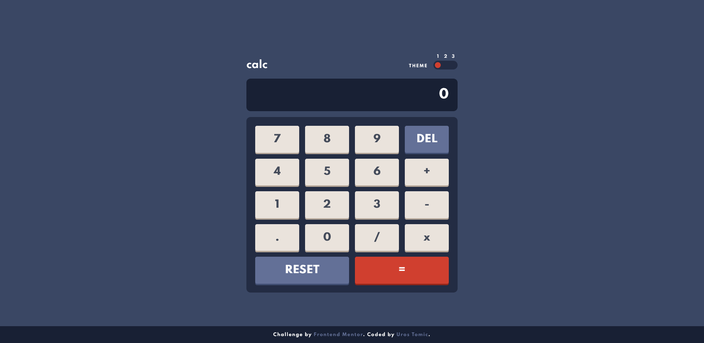

# Frontend Mentor - Calculator app solution

This is a solution to the [Calculator app challenge on Frontend Mentor](https://www.frontendmentor.io/challenges/calculator-app-9lteq5N29). Frontend Mentor challenges help you improve your coding skills by building realistic projects. 

## Table of contents

- [Overview](#overview)
  - [The challenge](#the-challenge)
  - [Screenshot](#screenshot)
  - [Links](#links)
- [My process](#my-process)
  - [Built with](#built-with)
  - [What I learned](#what-i-learned)
  - [Continued development](#continued-development)
  - [Useful resources](#useful-resources)
- [Author](#author)

## Overview

### The challenge

Users should be able to:

- See the size of the elements adjust based on their device's screen size
- Perform mathmatical operations like addition, subtraction, multiplication, and division
- Adjust the color theme based on their preference
- **Bonus**: Have their initial theme preference checked and have any additional changes saved in the browser

### Screenshots




### Links

- Solution URL: [https://www.frontendmentor.io/solutions/localstorage-regex-sass-X4ekBCyU4](https://www.frontendmentor.io/solutions/localstorage-regex-sass-X4ekBCyU4)
- Live Site URL: [https://mrgeminus.github.io/calculator-app-main/](https://mrgeminus.github.io/calculator-app-main/)

## My process

### Built with

- Semantic HTML5 markup
- CSS pre-processor (SASS)
- Mobile-first workflow
- BEM naming convention
- Flexbox
- Regular expression
- TypeScript

### What I learned

I learned a lot about RegExp and TypeScript. 

A great example would be this function that checks the passed string and returns a modified version of it with
, as thousand separator and . as a decimal separator.

```ts
function formatString(value) {
    return value.replace(/\B(?<!\.\d*)(?=(\d{3})+(?!\d))/g, ",");
}
```

### Continued development

I'd definitely plan to get better at writing JavaScript and TypeScript code.

### Useful resources

- [RegExp - MDN](https://developer.mozilla.org/en-US/docs/Web/JavaScript/Guide/Regular_Expressions) - Great sourse for learning about RegExp.
- [RegExp - W3Schools](https://www.w3schools.com/jsref/jsref_obj_regexp.asp) - Another great sourse for learning about RegExp.
- [Thousands Digit Separators](https://regexr.com/) - great tool for writing and testing the regular expression
- [Stackoverflow](https://stackoverflow.com/questions/2901102/how-to-print-a-number-with-commas-as-thousands-separators-in-javascript) - This post on StackOverflow helped me understand and implement the number formatting with JavaScript
- [Custom Theme Toggler](https://www.youtube.com/watch?v=ZKXv_ZHQ654&list=LL&index=81) - This helped me with the toggler design. Gary is an amazing UX/UI Designer.
I'd definitely recommend to anyone to check his channel.
- [TypeScript Crash Course](https://www.youtube.com/watch?v=rAy_3SIqT-E&t=2202s) - In this video Brad explains the basics
of TypeScript

## Author

- Website - [Uros Tomic](https://mrgeminus.com/)
- Frontend Mentor - [@MrGeminus](https://www.frontendmentor.io/profile/MrGeminus)
- LinkedIn - [Uros Tomic](https://www.linkedin.com/in/mrgeminus/)
- Xing - [Uros Tomic](https://www.xing.com/profile/Uros_Tomic3/cv)
- StackOverflow - [MrGeminus](https://www.linkedin.com/in/mrgeminus/)
- Twitter - [@MrGeminus](https://twitter.com/MrGeminus)

