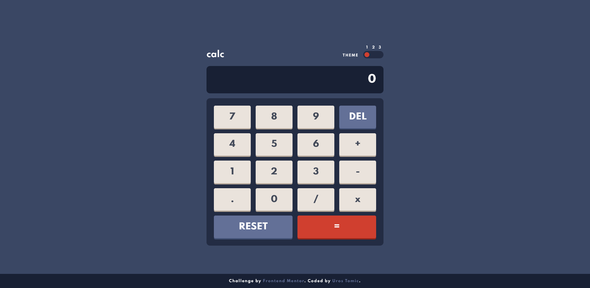
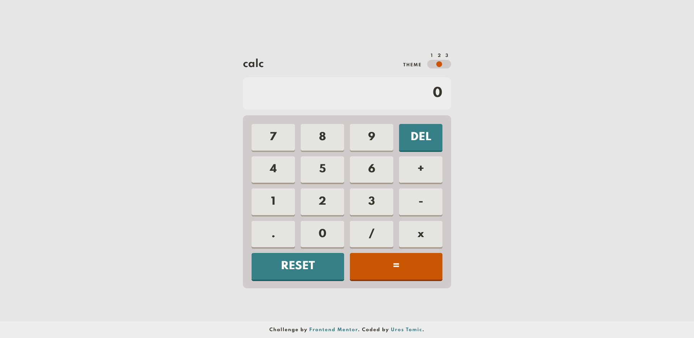
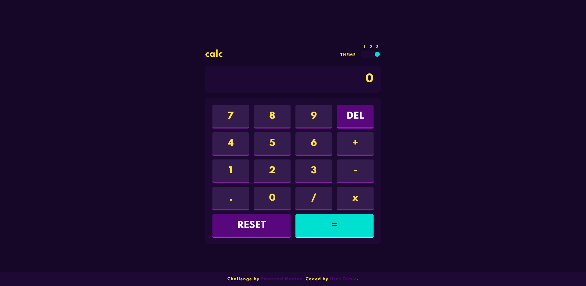

# Frontend Mentor - Calculator app solution

This is a solution to the [Calculator app challenge on Frontend Mentor](https://www.frontendmentor.io/challenges/calculator-app-9lteq5N29). Frontend Mentor challenges help you improve your coding skills by building realistic projects. 

## Table of contents

- [Overview](#overview)
  - [The challenge](#the-challenge)
  - [Screenshot](#screenshot)
  - [Links](#links)
- [My process](#my-process)
  - [Built with](#built-with)
  - [What I learned](#what-i-learned)
  - [Continued development](#continued-development)
  - [Useful resources](#useful-resources)
- [Author](#author)
- [Acknowledgments](#acknowledgments)

## Overview

### The challenge

Users should be able to:

- See the size of the elements adjust based on their device's screen size
- Perform mathmatical operations like addition, subtraction, multiplication, and division
- Adjust the color theme based on their preference
- **Bonus**: Have their initial theme preference checked and have any additional changes saved in the browser

### Screenshots

### Links

- Solution URL: [Add solution URL here](https://your-solution-url.com)
- Live Site URL: [https://mrgeminus.github.io/calculator-app-main/](https://mrgeminus.github.io/calculator-app-main/)

## My process

### Built with

- Semantic HTML5 markup
- SASS
- Flexbox
- JavaSript

### What I learned

I learned about Prefers-Color-Scheme, 

### Continued development

I'd definitely like to get better at JavaScript and maybe also learn Vue.js.

### Useful resources

- [RegExp - MDN](https://developer.mozilla.org/en-US/docs/Web/JavaScript/Guide/Regular_Expressions) - This helped me for XYZ reason. I really liked this pattern and will use it going forward.
- [RegExp - W3Schools](https://www.w3schools.com/jsref/jsref_obj_regexp.asp) - This is an amazing article which helped me finally understand XYZ. I'd recommend it to anyone still learning this concept.
- [Custom Toggler](https://www.youtube.com/watch?v=ZKXv_ZHQ654&list=LL&index=81) - This helped me with the toggler design. Gary is an amazing UX/UI Designer.
I'd definitely recommend to anyone to check his channel.

## Author

- Website - [www.mrgeminus.com](https://mrgeminus.com/)
- Frontend Mentor - [@MrGeminus](https://www.frontendmentor.io/profile/MrGeminus)
- Twitter - [@MrGeminus](https://twitter.com/MrGeminus)

